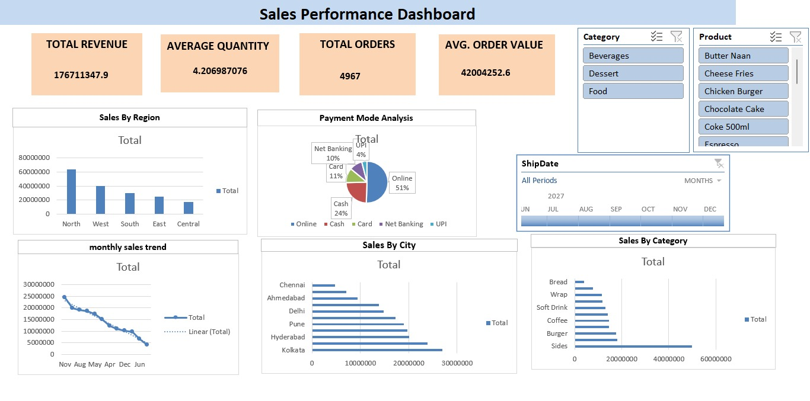

# Sales Analytics Dashboard

## Project Overview
This project is an interactive Sales Analytics Dashboard built in Microsoft Excel.

## Features
- Total Sales KPI
- Total Profit KPI
- Sales by Region
- Monthly Sales Trend
- Top Products Analysis
- Interactive Filters (Slicers)

## Tools Used
- Microsoft Excel
- Pivot Tables
- Pivot Charts
- Slicers
- Conditional Formatting

## Files
- Sales_Analytics_Dashboard.xlsx
- sales_messy_dataset_cleaned-RUHI.xlsx
- dashboard.png.jpeg
## Dashboard Screenshot

